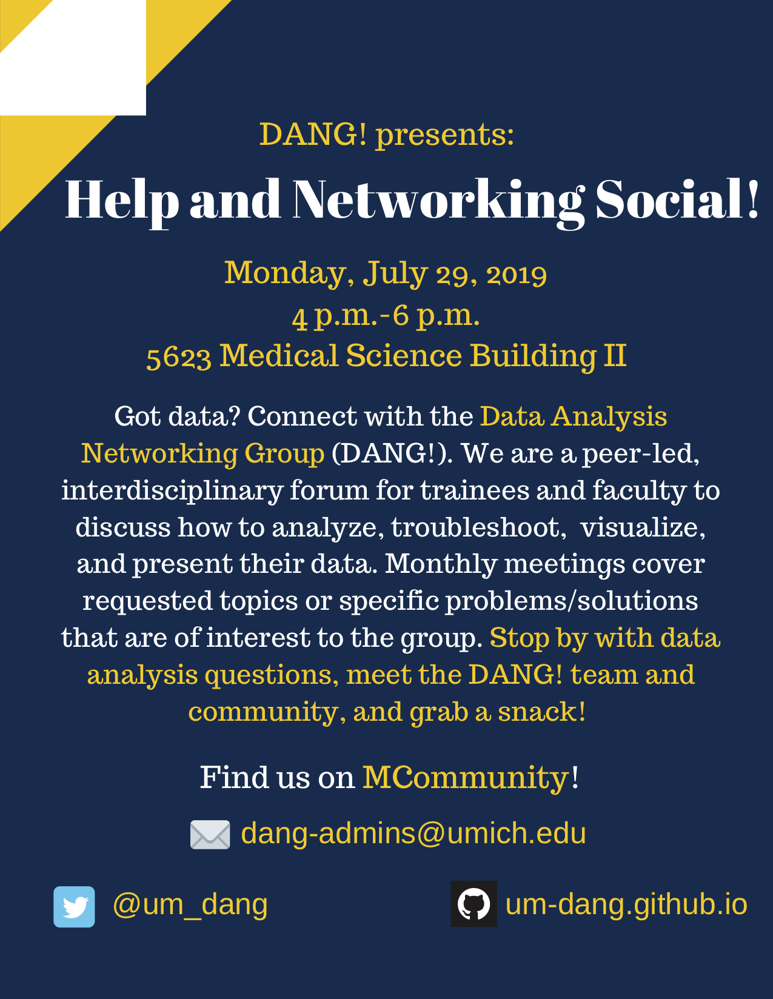

<!-- TOC depthFrom:1 depthTo:6 withLinks:1 updateOnSave:1 orderedList:0 -->

- [Upcoming events](#upcoming-events)
	- [July 2019: Help & Networking Social](#july-2019-help-networking-social)
- [Past Events](#past-events)
	- [May 2019: An Introduction to Cytoscape](#may-2019-an-introduction-to-cytoscape)
	- [Feb 2019: Transitioning from Flux](#feb-2019-transitioning-from-flux)
	- [Apr 2019: Literate Programming](#apr-2019-literate-programming)
	- [Mar 2019: Making UNIX Yours](#mar-2019-making-unix-yours)

<!-- /TOC -->

# Upcoming events

## July 2019: Help & Networking Social

**Monday, July 29, 2019 \| 4-6 p.m. \| 5623 Med Sci II**

Stop by with data analysis questions, meet the _DANG!_ team &
community, and grab a snack!

# Past Events

## May 2019: An Introduction to Cytoscape

**May 20, 2019 \| 4-5pm \| Room 5623 Med Sci II**

_An Introduction to Cytoscape: A tool for network visualization_

Presented by Justin Joque, PhD - Visualization Librarian

## Feb 2019: Transitioning from Flux

**Feb 18, 2019 \| 4-5pm \| Room 5623 Med Sci II**

_Transitioning from Flux to the new high-performance Great Lakes Cluster_

## Apr 2019: Literate Programming

**Apr 22, 2019 \| 4-5pm \| Room 5623 Med Sci II**

_Literate Programming: Creating reproducible reports using RMarkdown_

Presented by Zena Lapp, PhD Candidate - Department of Computational Medicine & Bioinformatics

## Mar 2019: Making UNIX Yours

**Mar 25, 2019 \| 4-5pm \| Room 5623 Med Sci II**

_Making UNIX Yours: Improving data analysis workflow through bash customization_
