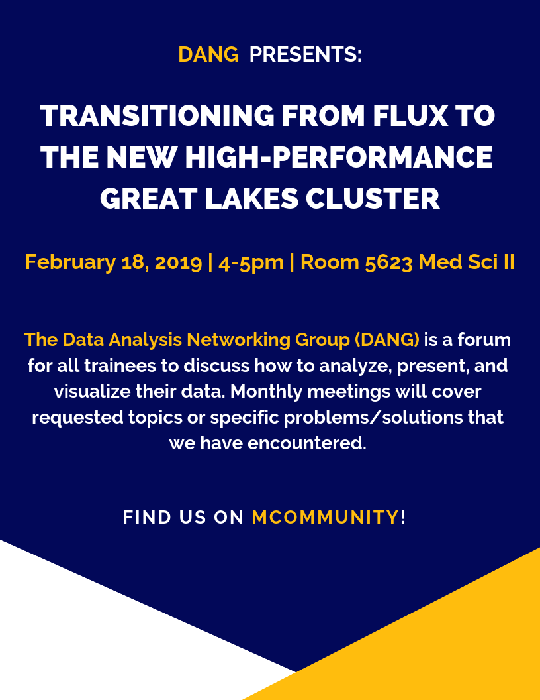
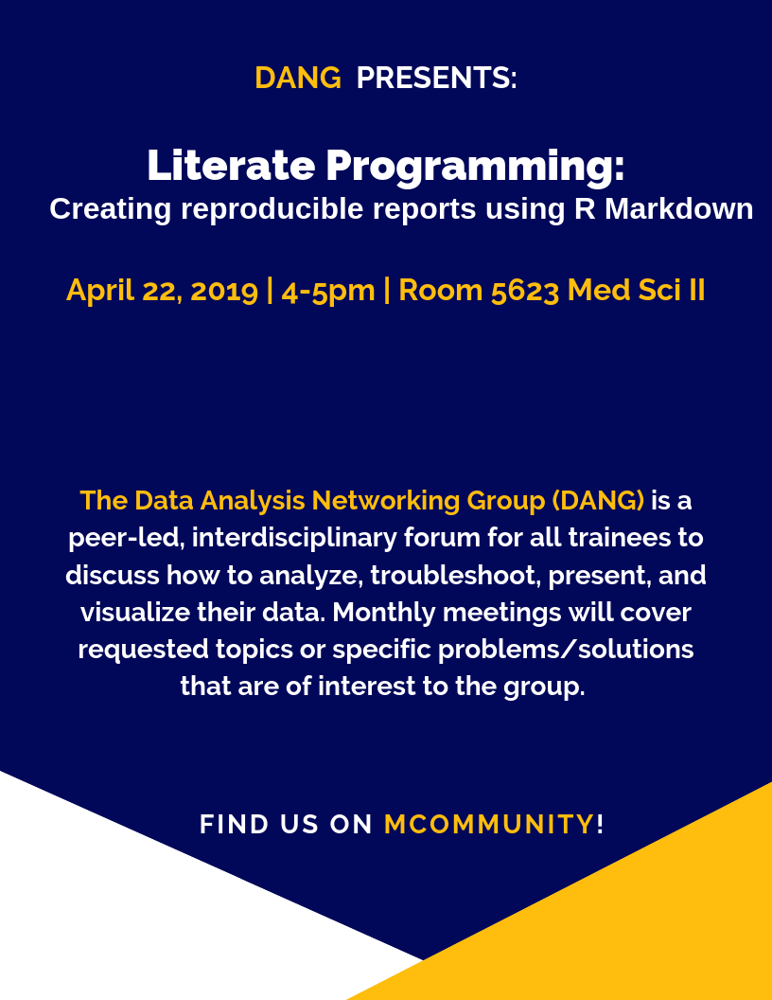
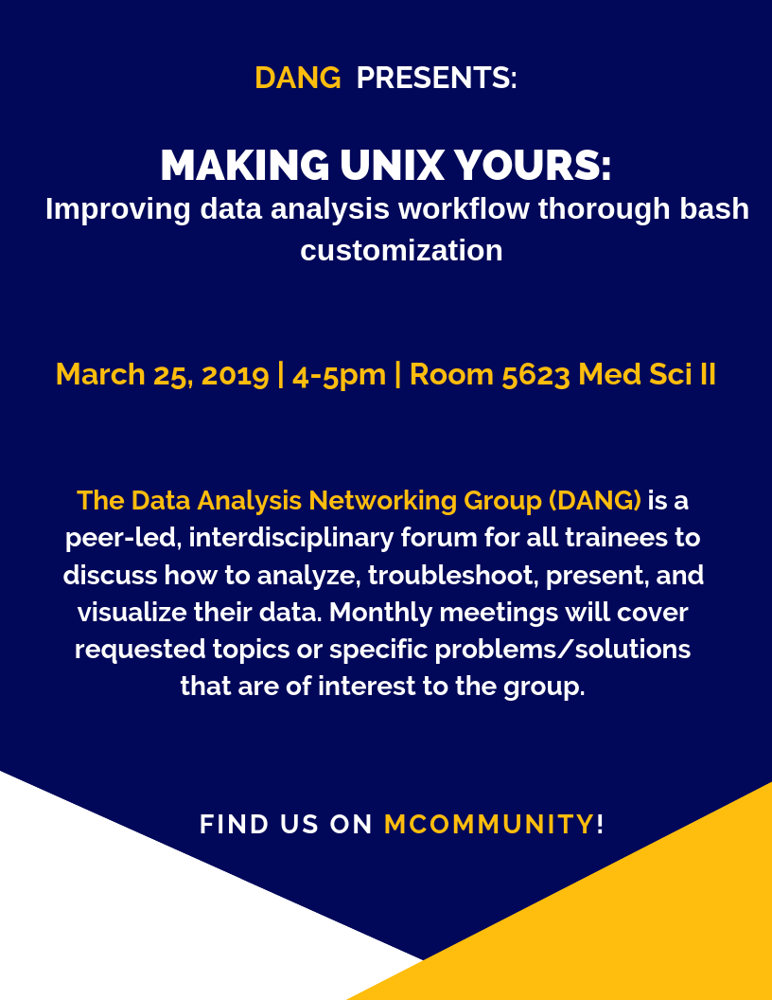

<!-- TOC depthFrom:1 depthTo:6 withLinks:1 updateOnSave:1 orderedList:0 -->

- [Upcoming events](#upcoming-events)
	- [29 July 2019: Help & Networking Social](#29-july-2019-help-networking-social)
- [Past Events](#past-events)
	- [20 May 2019: An Introduction to Cytoscape](#20-may-2019-an-introduction-to-cytoscape)
	- [18 Feb 2019: Transitioning from Flux to the new high-performance Great Lakes Cluster](#18-feb-2019-transitioning-from-flux-to-the-new-high-performance-great-lakes-cluster)
	- [22 Apr 2019: Literate Programming: Creating reproducible reports using RMarkdown](#22-apr-2019-literate-programming-creating-reproducible-reports-using-rmarkdown)
	- [25 Mar 2019: Making UNIX Yours: Improving data analysis workflow through bash customization](#25-mar-2019-making-unix-yours-improving-data-analysis-workflow-through-bash-customization)

<!-- /TOC -->

# Upcoming events

## 29 July 2019: Help & Networking Social

# Past Events

## 20 May 2019: An Introduction to Cytoscape

## 18 Feb 2019: Transitioning from Flux to the new high-performance Great Lakes Cluster

## 22 Apr 2019: Literate Programming: Creating reproducible reports using RMarkdown

## 25 Mar 2019: Making UNIX Yours: Improving data analysis workflow through bash customization

